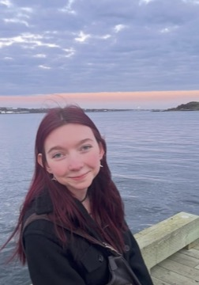

## Hi there 👋
### Who Am I?
       
**Maddy Burd** 

*Third Year Neuroscience Student*

## Why Neuroscience?
I am very passionate about mental health and have always been interested in pursuing psychology. After taking biology courses in high school, I realized I was also quite interested in the physiological aspects of mental health and the biology of the brain. This led me perfectly to neuroscience!

## Why Neural Data Science?
I *love* puzzles, logic games, and figuring out a tough problem, so I'm shocked I've gone this long without learning to code! This course seemed like the perfect opportunity to get started in coding, a skill which I'm hoping will allow for many more opportunities in the future, from data analysis to brain-computer interfaces.

## What Next?
I haven't decided yet if I ultimately want to pursue clinical or research work with neuroscience, but there are many interesting topics I hope to explore more along the way to wherever I end up! Some of these include:
- **genetics**
  - genetic and epigenetic basis of mental illness
  - genetic and epigenetic basis of addiction
- **addiction**
- **neuroplasticity**
  - therapeutic implications
- **music**
  - *less related to the other topics, but I think things like perfect pitch and the individual differences in musicality are so cool!*    

